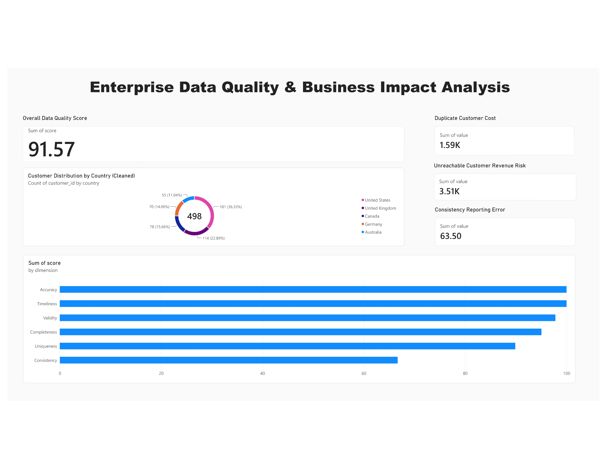

# Enterprise Data Quality & Business Impact Analysis
### Deployed by: Arvind Yadav | Data Analyst Portfolio

An end-to-end data quality audit pipeline that profiles a customer/order dataset across 6 standard DQ dimensions, quantifies the business cost of each issue, and visualizes findings in an interactive Power BI dashboard.

## 📊 Executive Overview
- **Project Lead:** Arvind Yadav (Data Analyst)
- **Overall Data Quality Score: 91.57%**
- **Audited Records:** 525 customer records and 1,500 order records
- **Quantifiable Business Risk:** $5,100+ in annual revenue leakage identified
- **Key Discovery:** Found a massive 63.5% under-reporting error in the largest customer segment caused by inconsistent country naming formats.

## 🚨 The Business Problem
In modern data infrastructure, poor data quality is not just a software bug—it is a direct financial drain on business operations. Siloed data entries often hide critical redundancies and formatting anomalies. Without an automated framework to audit data metrics, organizations make critical decisions based on fragmented reporting segmentations, leading to wasted marketing spend and hidden pipeline risks.

## 🛠️ Operational Approach
1. **Data Generation:** Engineered a realistic enterprise dataset simulating common manual entry and pipeline migration failures.
2. **Modular Audit Engine:** Built a reusable Python ETL pipeline profiling data across 6 standard DQ dimensions: Completeness, Uniqueness, Validity, Consistency, Accuracy, and Timeliness.
3. **Targeted Data Cleansing:** Applied advanced string mapping, format-aware date parsing, and optimized Regular Expressions (Regex) to consolidate fragmented country categories.
4. **Financial Loss Framework:** Quantified operational failures using a comprehensive Cost-of-Poor-Quality (COPQ) model.
5. **Executive Intelligence Reporting:** Visualized the post-cleaning data matrices and risk segments in a production-grade Power BI dashboard.

## 📈 Core Metrics & Key Findings

| Dimension | Quality Index | Identified Core Anomaly | Operational Impact |
|---|---|---|---|
| **Consistency** | 66.67% | 175 records contained non-standard country strings (`US`, `USA`) | **63.5% Under-reporting** in US segment |
| **Uniqueness** | 89.90% | 53 structural duplicate customer entries detected | **$1,590/year** Wasted marketing spend |
| **Completeness** | 95.05% | 15% missing critical contact fields (Email/Phone) | **$3,510** Operational revenue at risk |

## 💻 Technical Stack & Environment
- **Data Engineering:** Python, Pandas, Regular Expressions (Regex), Jupyter Notebooks.
- **Business Intelligence:** Power BI Desktop, Star Schema Modeling, Many-to-One (*:1) Relational Joins.
- **Infrastructure:** Virtualized Windows 11 framework deployed via UTM bridge with automated SPICE WebDAV host sync.

## 🏃‍♂️ Pipeline Execution & Reproducibility
To spin up the automated pipeline and regenerate the clean target outputs, install the environment-lock configurations and run the orchestration scripts:
```bash
pip install -r requirements.txt
python3 scripts/generate_data.py
python3 scripts/dq_pipeline.py
```

## 🖥️ Live Production Dashboard View


---
*Developed by Arvind Yadav - Connect with me for Data Analyst roles.*

